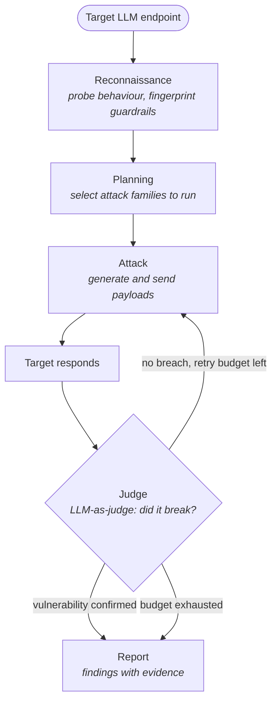

# LLM Red Team Agents

A multi-agent system that automates adversarial security testing of LLM applications — give it an endpoint, get back a list of validated vulnerabilities.

> **Status: Phase 0 — architecture validated, attack library in progress.**
> The full agent loop (attacker → target → judge) runs end to end, but the attack
> payloads are currently placeholders. Real attack families are the next milestone.
> See the [roadmap](#roadmap) for what is and isn't implemented.

---

## Why this project

Classic web penetration testing looks for flaws in *code*: an SQL injection either
works or it doesn't. Testing an LLM application is a different problem — the system
is **probabilistic**. The same prompt injection may succeed one time in three, and
there is no clean proof of exploitation: the output is free-form text.

That raises the question this project is built around:

**How do you decide, automatically, that an attack succeeded?**

The answer used across the field is an *LLM-as-judge* — a second model that reads the
exchange and rules on it. Making that judge reliable is the core technical challenge,
and the reason this repository exists.

## Architecture

A set of specialised agents, each owning one phase, coordinated in a loop. Failed
attempts are reformulated and retried within a fixed budget.



Two design decisions worth calling out:

**A single abstraction layer for every model call.** No agent ever talks to a provider
directly — everything goes through `demander_au_llm()` in `llm_client.py`. Switching
between a local model and a hosted API is a one-line change in `config.py`, and nothing
else in the codebase moves.

**An explicit retry budget.** Because attacks are probabilistic, an adaptive agent will
happily loop forever. `MAX_ESSAIS` bounds every campaign — a correctness concern as much
as a cost one.

## Attack surface targeted

Testing follows the [OWASP Top 10 for LLM Applications](https://owasp.org/www-project-top-10-for-large-language-model-applications/):

- Prompt injection — overriding the application's instructions
- Jailbreaks — bypassing safety guardrails
- System prompt leakage — extracting hidden instructions
- Sensitive information disclosure
- Insecure output handling

## Project structure

```
.
├── config.py          # single switch: local model vs hosted API
├── llm_client.py      # the abstraction layer — every model call goes through here
├── cible.py           # the system under test (currently a guardrailed decoy)
├── agents/
│   ├── attaquant.py   # generates attack attempts
│   └── arbitre.py     # LLM-as-judge: rules on success or failure
└── main.py            # orchestrator: runs the campaign loop
```

## Getting started

Runs fully locally, no API key and no cost, against a model served by [Ollama](https://ollama.com).

```bash
git clone https://github.com/mchx-cs/agentic-llm-redteam.git
cd agentic-llm-redteam

python -m venv .venv
source .venv/bin/activate      # Windows: .venv\Scripts\activate
pip install -r requirements.txt

ollama pull llama3.2
python main.py
```

Expected output is three test exchanges, each with the payload sent, the target's reply,
and the judge's reasoned verdict.

### Switching to a hosted API

Fill in the `api` profile in `config.py`, export your key, and change one line:

```python
PROFIL_ACTIF = "api"
```

## Roadmap

| Phase | Scope | Status |
|---|---|---|
| **0** | Agent loop, abstraction layer, LLM-as-judge, retry budget | **Done** |
| **1** | Real prompt injection payload library | In progress |
| **2** | Judge reliability — measuring and reducing false positives/negatives | Planned |
| **3** | Adaptive attacker: reformulate based on the target's previous reply | Planned |
| **4** | Decouple judge from target model (a judge sharing its target's blind spots is a known bias) | Planned |
| **5** | Reconnaissance and planning agents; multi-family campaigns | Planned |
| **6** | Report generation with severity ranking | Planned |
| **7** | Integrate [garak](https://github.com/NVIDIA/garak) for breadth and [PyRIT](https://github.com/Azure/PyRIT) for multi-turn orchestration | Planned |

## Stack

Python · Ollama (local inference) · OpenAI-compatible API clients

Reference frameworks studied for this project: [garak](https://github.com/NVIDIA/garak)
(NVIDIA) for vulnerability scanning breadth, and [PyRIT](https://github.com/Azure/PyRIT)
(Microsoft) for multi-turn adversarial orchestration.

## Responsible use

This is a security research and learning project. LLM red teaming is lawful only
against systems you own or have **explicit written authorisation** to test — the same
framework that governs any penetration testing engagement. Use it on your own
deployments and purpose-built targets, never against a third-party service without
permission.

## Author

**Clément Monchaux** — cybersecurity student, focused on offensive security and AI security.
[LinkedIn](https://www.linkedin.com/in/cl%C3%A9ment-monchaux/)
